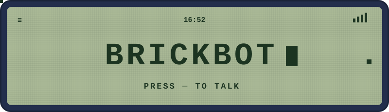
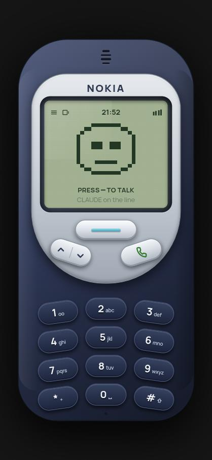
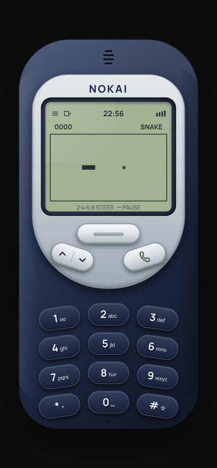

<p align="center">
  
</p>

**The brick is back, and it talks.**

A NOKAI 3310 in your browser with Claude on the line. Press the green key,
speak, it speaks back. Local Whisper ears, your own Claude Code session for
a brain, edge-tts voice, pixel face lip-syncing on a monochrome LCD.
No API keys. No cloud middleman. Your GPU, your terminal, your call.

<table align="center">
  <tr>
    <td align="center"></td>
    <td align="center"></td>
  </tr>
  <tr>
    <td align="center"><sub><b>the brick</b> · claude on the line</sub></td>
    <td align="center"><sub><b>the waiting room</b> · snake II, real gameplay</sub></td>
  </tr>
</table>

## Wire

```
you ──mic──► whisper (CUDA) ──► claude CLI ──► edge-tts ──speaker──► you
                    all glued by one WebSocket bridge on :3010
```

## Run it

Node 18+ · pnpm · Python 3.10+ (`faster-whisper`, `edge-tts`) · ffmpeg ·
NVIDIA GPU · [Claude Code CLI](https://claude.ai/code) logged in.

```bash
pnpm install
pnpm dev        # phone  → http://localhost:3000
pnpm bridge     # bridge → ws://localhost:3010

CLAUDE_MODEL=claude-sonnet-5 pnpm bridge   # faster mouth, smaller bill
```

Signal bars don't lie. Full = connected.

## Drive it

| Key | Move |
|---|---|
| 🟢 green key | live call — talk, pause, it answers, repeat. hands stay in pockets |
| ─ navi key | push-to-talk. dash burns red while it records you |
| ▲▼ rocker | menu: Transcript · Snake II · Settings |
| 1 2 3 | every answer ends with three moves. press one. IVR like it's 1999 |
| 2 4 6 8 | the snake obeys |

Claude got you waiting? Up-arrow → **Snake II**. Wrap-around walls,
9 points a feed, gets faster the longer you live. The mouth on the LCD
moves word-by-word off real TTS timings, the bars dance to real audio —
yours while you talk, Claude's while it answers. Nothing on that screen
is faking it.

## Read the docs

- [HANDOFF.md](HANDOFF.md) — protocol, file map, state machine, tuning, every gotcha we hit
- [PRINCIPLE.md](PRINCIPLE.md) — one law: *if it wouldn't exist on a 1999 Nokia, it doesn't ship*

## Lock your door

The bridge hands the phone a Claude session with **full tool access**. It
binds `127.0.0.1` only — the LAN can't talk to your terminal. If you set
`BRIDGE_HOST=0.0.0.0`, you did that to yourself.

## Respect

Chassis born from [Played](https://github.com/sidhyatikku/music-player-skin)
by Sidhya Tikku · voice pipeline from
[claude-avatar](https://github.com/AgricIDaniel/claude-avatar) ·
[faster-whisper](https://github.com/SYSTRAN/faster-whisper) ·
[edge-tts](https://github.com/rany2/edge-tts)

GPL-3.0. Came from free code, stays free.
